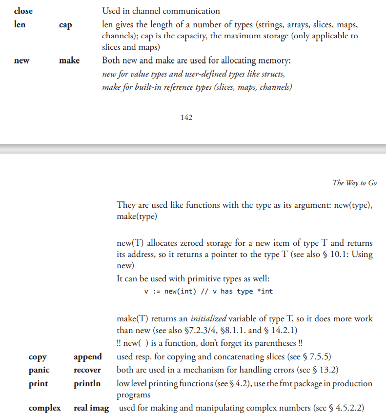

# notes for GO

## install

1. wgets the latest version 1.16.5

1. Extract the archive you downloaded into /usr/local, creating a Go tree in /usr/local/go.
   Important: This step will remove a previous installation at /usr/local/go, if any, prior to extracting. Please back up any data before proceeding.

For example, run the following as root or through sudo:

`rm -rf /usr/local/go && tar -C /usr/local -xzf go1.16.5.linux-amd64.tar.gz`

1. Add /usr/local/go/bin to the PATH environment variable.
   You can do this by adding the following line to your $HOME/.profile or /etc/profile (for a system-wide installation):

`export PATH=$PATH:/usr/local/go/bin`
Note: Changes made to a profile file may not apply until the next time you log into your computer. To apply the changes immediately, just run the shell commands directly or execute them from the profile using a command such as source $HOME/.profile.

1. Verify that you've installed Go by opening a command prompt and typing the following command:
   $ `go version`
   sudo sanitizes environment, you need to either pass -E option or add GOROOT_BOOTSTRAP to env_keep in /etc/sudoers:

1. set up environment variable
   `export GOROOT=/usr/local/go`
   为了确保相关文件在文件系统的任何地方都能被调用,你还需要添加以下内容:

   `export PATH=$PATH:$GOROOT/bin`

   在开发 Go 项目时,你还需要一个环境变量来保存你的工作目录。

   `export GOPATH=$HOME/Applications/Go`

1. 构建 Go

在终端使用以下指令来进行编译工作。

cd $GOROOT/src
./all.bash

Error: Set $GOROOT_BOOTSTRAP to a working Go tree >= Go 1.4.
Reason: Go is written in Go (starting from version 1.5) so you have to install Go1.4 first.
Solution: downloaded Go 1.4 binaries and moved it to `/usr/local/go1.4/go`.
Also I defined GOROOT_BOOTSTRAP variable as `export GOROOT_BOOTSTRAP=/usr/local/go1.4/go`
Rerun ./all.bash

Error2: user doesn't have write privileges in folder with go1.4, but sudo ./all.bash cannot detect environment variable
Reason: sudo sanitizes environment, you need to either pass -E option or add GOROOT_BOOTSTRAP to env_keep in /etc/sudoers
Solution: run `sudo -E ./all.bash`.

## Go 程序的基本结构和要素

- 可见性规则

当标识符（包括常量、变量、类型、函数名、结构字段等等）以一个大写字母开头,如:Group1,那么使用这种形式的标识符的对象就可以被外部包的代码所使用（客户端程序需要先导入这个包）,这被称为导出（像面向对象语言中的 public）；标识符如果以小写字母开头,则对包外是不可见的,但是他们在整个包的内部是可见并且可用的（像面向对象语言中的 private ）。

· 在完成包的 import 之后,开始对常量、变量和类型的定义或声明。
· 如果存在 init 函数的话,则对该函数进行定义（这是一个特殊的函数,每个含有该函数的包都会首先执行这个函数）。
· 如果当前包是 main 包,则定义 main 函数。
· 然后定义其余的函数,首先是类型的方法,接着是按照 main 函数中先后调用的顺序来定义相关函数,如果有很多函数,则可以按照字母顺序来进行排序。

Go 程序的执行（程序启动）顺序如下:

· 按顺序导入所有被 main 包引用的其它包,然后在每个包中执行如下流程:
· 如果该包又导入了其它的包,则从第一步开始递归执行,但是每个包只会被导入一次。
· 然后以相反的顺序在每个包中初始化常量和变量,如果该包含有 init 函数的话,则调用该函数。
· 在完成这一切之后,main 也执行同样的过程,最后调用 main 函数开始执行程序

· Go 语言不存在隐式类型转换,因此所有的转换都必须显式说明
`valueOfTypeB = typeB(valueOfTypeA)`

- 常量使用关键字 const 定义,用于存储不会改变的数据。`const identifier [type] = value`
  常量的值必须是能够在编译时就能够确定的；你可以在其赋值表达式中涉及计算过程,但是所有用于计算的值必须在编译期间就能获得。
  在编译期间自定义函数均属于未知,因此无法用于常量的赋值,但内置函数可以使用,如:len ()。
  反斜杠 `\` 可以在常量表达式中作为多行的连接符使用。
  常量还可以用作枚举:

```go
const (
    Unknown = 0
    Female = 1
    Male = 2
)
```

- 变量

声明变量的一般形式是使用 var 关键字:var identifier type。

```go
var (
    a int
    b bool
    str string
)

```

- 当一个变量被声明之后,系统自动赋予它该类型的零值:int 为 0,float 为 0.0,bool 为 false,string 为空字符串,指针为 nil。记住,所有的内存在 Go 中都是经过初始化的。
- Variables etc. declared outside of any function (in other words at the top level) have global (or
  package) scope: they are visible and available in all source files of the package.
  Variables declared in a function have local scope: they are only known in that function, the same
  goes for parameters and return-variables.

- `:=` 可用于初始化 variable。 `a:=50`, 但是该符号只可用一次,初始化后不可重复使用
  只能被用在函数体内,而不可以用于全局变量的声明与赋值
  当你在函数体内声明局部变量时,应使用简短声明语法 `:=`

- 空白标识符 `_` 也被用于抛弃值,如值 5 在:`_, b = 5, 7` 中被抛弃。

`_` 实际上是一个只写变量,你不能得到它的值。这样做是因为 Go 语言中你必须使用所有被声明的变量,但有时你并不需要使用从一个函数得到的所有返回值。

并行赋值也被用于当一个函数返回多个返回值时,比如这里的 val 和错误 err 是通过调用 Func1 函数同时得到:val, err = Func1(var1)

- string
  解释字符串:

该类字符串使用双引号括起来,其中的相关的转义字符将被替换,这些转义字符包括:

`\n`:换行符
`\r`:回车符
`\t`:tab 键
`\u` 或 `\U`:Unicode 字符
`\\`:反斜杠自身
非解释字符串:

该类字符串使用反引号括起来,支持换行,例如:

`This is a raw string \n` 中的 `\n\` 会被原样输出。

- if statement

```go
if val := 10; val > max {
    // do something
}
```

但要注意的是,使用简短方式 := 声明的变量的作用域只存在于 if 结构中（在 if 结构的大括号之间,如果使用 if-else 结构则在 else 代码块中变量也会存在）。如果变量在 if 结构之前就已经存在,那么在 if 结构中,该变量原来的值会被隐藏。最简单的解决方案就是不要在初始化语句中声明变量

- case

每一个 `case` 分支都是唯一的,从上至下逐一测试,直到匹配为止。（ Go 语言使用快速的查找算法来测试 switch 条件与 case 分支的匹配情况,直到算法匹配到某个 `case` 或者进入 `default` 条件为止。）

一旦成功地匹配到某个分支,在执行完相应代码后就会退出整个 `switch` 代码块,也就是说您不需要特别使用 break 语句来表示结束。

因此,程序也不会自动地去执行下一个分支的代码。如果在执行完每个分支的代码后,还希望继续执行后续分支的代码,可以使用 `fallthrough` 关键字来达到目的。

switch 语句的第二种形式是不提供任何被判断的值（实际上默认为判断是否为 true）,然后在每个 case 分支中进行测试不同的条件。当任一分支的测试结果为 true 时,该分支的代码会被执行。这看起来非常像链式的 if-else 语句,但是在测试条件非常多的情况下,提供了可读性更好的书写方式。

```go
switch {
    case condition1:
        ...
    case condition2:
        ...
    default:
        ...
}
```

在下面这个代码片段中,变量 a 和 b 被平行初始化,然后作为判断条件:

```go
switch a, b := x[i], y[j]; {
    case a < b: t = -1
    case a == b: t = 0
    case a > b: t = 1
}

```

- for-each

一般形式为:`for ix, val := range coll { }`。

要注意的是,val 始终为集合中对应索引的值拷贝,因此它一般只具有只读性质,对它所做的任何修改都不会影响到集合中原有的值（译者注:如果 val 为指针,则会产生指针的拷贝,依旧可以修改集合中的原值）。一个字符串是 Unicode 编码的字符（或称之为 rune）集合,因此您也可以用它迭代字符串:

```go
for pos, char := range str {
...
}
```

每个 `rune` 字符和索引在 `for-range` 循环中是一一对应的。它能够自动根据 UTF-8 规则识别 Unicode 编码的字符。

- LABEL

定义但未使用标签会导致编译错误:label … defined and not used。

- func

如果需要申明一个在外部定义的函数,你只需要给出函数名与函数签名,不需要给出函数体:

`func flushICache(begin, end uintptr) // implemented externally`
函数也可以以申明的方式被使用,作为一个函数类型,就像:

`type binOp func(int, int) int`
在这里,不需要函数体 {}。

· 函数作为第一类值（first-class value）:可以赋值给变量,就像 add := binOp 一样。

这个变量知道自己保存的函数签名,给它赋值一个具有不同签名的函数值是不可能的。

· 函数值（functions value）之间可以相互比较:如果它们引用相同的函数或者都是 nil 的话,则认为它们是相同的函数。函数不能在其它函数里面声明（不能嵌套）,不过我们可以通过使用匿名函数（参考 第 6.8 节）来破除这个限制。

· 命名返回值作为结果形参（result parameters）被初始化为相应类型的零值,当需要返回的时候,我们只需要一条简单的不带参数的 return 语句。需要注意的是,即使只有一个命名返回值,也需要使用 () 括起来

- Blank identifier
  The blank identifier `_` can be used to discard values, effectively assigning the right-hand-side value
  to nothing

- 传递变长参数

如果函数的最后一个参数是采用 ...type 的形式,那么这个函数就可以处理一个变长的参数,这个长度可以为 0,这样的函数称为变长函数。

`func myFunc(a, b, arg ...int) {}`

一个接受变长参数的函数可以将这个参数作为其它函数的参数进行传递;变长参数可以作为对应类型的 slice 进行二次传递。

```go
func F1(s ...string) {
    F2(s...)
    F3(s)
}

func F2(s ...string) { }
func F3(s []string) { }
```

- 内置函数



- 闭包 anonymous func

```go
func() {
    sum := 0
    for i := 1; i <= 1e6; i++ {
        sum += i
    }
}()
```

表示参数列表的第一对括号必须紧挨着关键字 func,因为匿名函数没有名称。花括号 {} 涵盖着函数体,最后的一对括号表示对该匿名函数的调用。

匿名函数像所有函数一样可以接受或不接受参数。下面的例子展示了如何传递参数到匿名函数中:

```go
func (u string) {
    fmt.Println(u)
    …
}(v)
```

- array

声明格式:`var identifier [len]type`

常量:
`var arrAge = [5]int{18, 20, 15, 22, 16}`
注意 `[5]int` 可以从左边起开始忽略:`[10]int {1, 2, 3}` : 这是一个有 10 个元素的数组,除了前三个元素外其他元素都为 0。

第二种变化:

`var arrLazy = [...]int{5, 6, 7, 8, 22}`
`...` 可同样可以忽略,从技术上说它们其实变化成了切片。

第三种变化:`key: value syntax`

`var arrKeyValue = [5]string{3: "Chris", 4: "Ron"}`
只有索引 3 和 4 被赋予实际的值,其他元素都被设置为空的字符串

- slice

  切片是一个 长度可变的数组。
  切片提供了计算容量的函数 `cap()` 可以测量切片最长可以达到多少:它等于切片从第一个元素开始,到相关数组末尾的元素个数。如果 s 是一个切片,`cap(s)` 就是从 `s[0]` 到数组末尾的数组长度。切片的长度永远不会超过它的容量,所以对于 切片 s 来说该不等式永远成立:`0 <= len(s) <= cap(s)`。

  Multiple slices can share data if they represent pieces of the same array; multiple arrays can never
  share data. A slice therefore shares storage with its underlying array and with other slices of the
  same array, by contrast distinct arrays always represent distinct storage. Arrays are in fact building
  blocks for slices

  · 优点 因为切片是引用,所以它们不需要使用额外的内存并且比使用数组更有效率,所以在 Go 代码中 切片比数组更常用。

  声明切片的格式是: `var identifier []type`（不需要说明长度）。

  一个切片在未初始化之前默认为 nil,长度为 0。

  切片的初始化格式是:`var slice1 []type = arr1[start:end]`。

  这表示 `slice1` 是由数组 `arr1` 从 `start` 索引到 `end-1` 索引之间的元素构成的子集（切分数组,start:end 被称为 slice 表达式）。所以 `slice1[0]` 就等于 `arr1[start]`。这可以在 `arr1` 被填充前就定义好。

  如果某个人写:`var slice1 []type = arr1[:]` 那么 `slice1` 就等于完整的 `arr1` 数组（所以这种表示方式是 `arr1[0:len(arr1)]` 的一种缩写）。另外一种表述方式是:`slice1 = &arr1`

  切片在内存中的组织方式实际上是一个有 3 个域的结构体:指向相关数组的指针,切片长度以及切片容量。下图给出了一个长度为 2,容量为 4 的切片 y。
  

  切片只能向后移动,`s2 = s2[-1:]` 会导致编译错误。切片不能被重新分片以获取数组的前一个元素。

  Warning: 绝对不要用指针指向 slice。切片本身已经是一个引用类型,所以它本身就是一个指针！

  - make
    当相关数组还没有定义时,我们可以使用 `make ()` 函数来创建一个切片 同时创建好相关数组:`var slice1 []type = make([]type, len)`。

  也可以简写为 `slice1 := make([]type, len)`,这里 `len` 是数组的长度并且也是 `slice` 的初始长度。

  make 的使用方式是:`func make([]T, len, cap)`,其中 cap 是可选参数。

- difference between `new()` and `make()`


- byte[] package

类型 []byte 的切片十分常见,Go 语言有一个 bytes 包专门用来解决这种类型的操作方法。

bytes 包和字符串包十分类似（参见第 4.7 节）。而且它还包含一个十分有用的类型 Buffer:

```go
import "bytes"

type Buffer struct {
...
}
```

这是一个长度可变的 `bytes` 的 `buffer`,提供 `Read` 和 `Write` 方法,因为读写长度未知的 bytes 最好使用 buffer。

`Buffer` 可以这样定义:`var buffer bytes.Buffer`。

或者使用 `new` 获得一个指针:`var r \*bytes.Buffer = new(bytes.Buffer)`。

或者通过函数:`func NewBuffer(buf []byte) \*Buffer`,创建一个 `Buffer` 对象并且用 buf 初始化好；`NewBuffer` 最好用在从 buf 读取的时候使用。

- string

![alt text] (https://cdn.learnku.com/uploads/images/201912/02/1/J9S85ymhtz.png!large)

Go 语言中的字符串是不可变的,也就是说 str[index] 这样的表达式是不可以被放在等号左侧的。如果尝试运行 str[i] = 'D' 会得到错误:cannot assign to str[i]。

因此,您必须先将字符串转换成字节数组,然后再通过修改数组中的元素值来达到修改字符串的目的,最后将字节数组转换回字符串格式。

例如,将字符串 “hello” 转换为 “cello”:

```go
s := "hello"
c := []byte(s)
c[0] = 'c'
s2 := string(c) // s2 == "cello"

```

- append

我们在第 7.5 节提到的 append 非常有用,它能够用于各种方面的操作:

将切片 b 的元素追加到切片 a 之后:`a = append(a, b...)`

复制切片 a 的元素到新的切片 b 上:

```go
b = make([]T, len(a))
copy(b, a)
```

删除位于索引 i 的元素:`a = append(a[:i], a[i+1:]...)`

切除切片 a 中从索引 i 至 j 位置的元素:`a = append(a[:i], a[j:]...)`

为切片 a 扩展 j 个元素长度:`a = append(a, make([]T, j)...)`

在索引 i 的位置插入元素 `x:a = append(a[:i], append([]T{x}, a[i:]...)...)`

在索引 i 的位置插入长度为 j 的新切片:`a = append(a[:i], append(make([]T, j), a[i:]...)...)`

在索引 i 的位置插入切片 b 的所有元素:`a = append(a[:i], append(b, a[i:]...)...)`

取出位于切片 a 最末尾的元素 `x:x, a = a[len(a)-1:], a[:len(a)-1]`

将元素 x 追加到切片 `a:a = append(a, x)`

因此,您可以使用切片和 append 操作来表示任意可变长度的序列。

- 切片和垃圾回收

切片的底层指向一个数组,该数组的实际容量可能要大于切片所定义的容量。只有在没有任何切片指向的时候,底层的数组内存才会被释放,这种特性有时会导致程序占用多余的内存。

- map

declaration:

```go
var map1 map[keytype]valuetype
var map1 map[string]int
```

key 可以是任意可以用 `==` 或者 `!=` 操作符比较的类型,比如 `string、int、float`。所以 slice 和 struct 不能作为 `key` (译者注:含有数组切片的结构体不能作为 key,只包含内建类型的 struct 是可以作为 key 的）,但是指针和接口类型可以。如果要用`struct`作为 `key` 可以提供 `Key()` 和 `Hash()` 方法,这样可以通过结构体的域计算出唯一的数字或者字符串的 key。

map 是 引用类型 的: 内存用 make 方法来分配。

map 的初始化:`var map1 = make(map[keytype]valuetype)`。

或者简写为:`map1 := make(map[keytype]valuetype)`。

- map value 是否存在

`val1, isPresent = map1[key1]`

`isPresent` 返回一个 `bool` 值:如果 `key1` 存在于 `map1,val1` 就是 `key1` 对应的 `value` 值,并且 `isPresent` 为 `true`；如果 `key1` 不存在,`val1` 就是一个空值,并且 `isPresent` 会返回 `false`。

如果你只是想判断某个 key 是否存在而不关心它对应的值到底是多少,你可以这么做:

`_, ok := map1[key1] // 如果key1存在则ok == true,否则ok为false`

从 map1 中删除 key1:直接 `delete(map1, key1)` 就可以。如果 key1 不存在,该操作不会产生错误。
