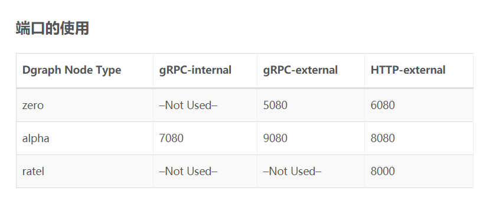

# Dgraph

[Dgraph 底层介绍](https://dbaplus.cn/news-160-3315-1.html)

[Dgraph 语法简介](https://blog.csdn.net/qq_24236769/article/details/84848913)

Dgraph cluster consists of different nodes (Zero, Alpha & Ratel), and each node serves a different purpose.

- Dgraph `Zero` controls the Dgraph cluster, assigns servers to a group, and re-balances data between server groups.

- Dgraph `Alpha` hosts predicates and indexes. Predicates are either the properties associated with a node or the relationship between two nodes. Indexes are the tokenizers that can be associated with the predicates to enable filtering using appropriate functions.

- `Ratel` serves the UI to run queries, mutations & altering schema.

You need at least one Dgraph Zero and one Dgraph Alpha to get started

Dgraph 支持单机部署和集群部署两种方式. 在 Dgraph 中有 zero, alpha,ratel 三类服务(也叫节点), 其中 zero 服务充当协调 alpha 的角色; alpha 则是对外提供数据写入和查询的服务, 外部的客户端主要都是和 alpha 交互; ratel 则是一个提供 UI 界面的服务, 方便用户写入/查询数据,查看/修改 schema.

## Ratel UI

ACL Account
The ACL Account login is necessary only when you have ACL features enabled.

The latest version (starting v.21), docker image for ratel is separated from docker image of alpha and zero.
For now we use an old image.

Note The default password for a cluster started from scratch is password and the user is groot.

## Client

Dgraph support python >=v2.7 and >=v3.5
need gRPC1.19.0

GO:
Depending on the version of Dgraph that you are connecting to, you will have to
use a different version of this client and their corresponding import paths.

<<<<<<< HEAD
| Dgraph version | dgo version  | dgo import path                 |
| -------------- | ------------ | ------------------------------- |
| dgraph 1.0.X   | dgo 1.X.Y    | "github.com/dgraph-io/dgo"      |
| dgraph 1.1.X   | dgo 2.X.Y    | "github.com/dgraph-io/dgo/v2"   |
| dgraph 20.03.0 | dgo 200.03.0 | "github.com/dgraph-io/dgo/v200" |
| dgraph 20.07.0 | dgo 200.03.0 | "github.com/dgraph-io/dgo/v200" |
| dgraph 20.11.0 | dgo 200.03.0 | "github.com/dgraph-io/dgo/v200" |
| dgraph 21.03.0 | dgo 210.03.0 | "github.com/dgraph-io/dgo/v210" |
=======
Dgraph version   | dgo version   |        dgo import path          |
---------------  | -----------   | ------------------------------- |
  dgraph 1.0.X   |  dgo 1.X.Y    |   "github.com/dgraph-io/dgo"    |
  dgraph 1.1.X   |  dgo 2.X.Y    | "github.com/dgraph-io/dgo/v2"   |
  dgraph 20.03.0 |  dgo 200.03.0 | "github.com/dgraph-io/dgo/v200" |
  dgraph 20.07.0 |  dgo 200.03.0 | "github.com/dgraph-io/dgo/v200" |
  dgraph 20.11.0 |  dgo 200.03.0 | "github.com/dgraph-io/dgo/v200" |
  dgraph 21.03.0 |  dgo 210.03.0 | "github.com/dgraph-io/dgo/v210" |
>>>>>>> bfbbf87b63e92b2b683e89bd56bd3375a167e2c1

Javascript (HTTP)
Dgraph version | dgraph-js-http version |
| :------------: | :--------------------: |
<<<<<<< HEAD
| >= 21.03.0 | >= _21.3.0_ |
| >= 20.03.0 | >= _20.3.0_ |
| >= 1.1 | >= _1.1.0_ |
=======
|   >= 21.03.0   |      >= _21.3.0_       |
|   >= 20.03.0   |      >= _20.3.0_       |
|     >= 1.1     |       >= _1.1.0_       |
>>>>>>> bfbbf87b63e92b2b683e89bd56bd3375a167e2c1
